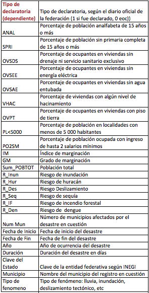
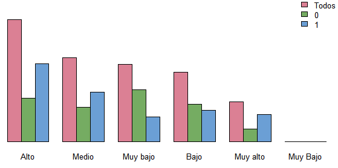
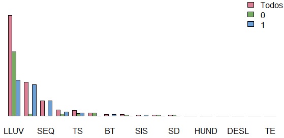

```{r}
library(knitr)
library(dplyr)
library(tidyr)
library(ggplot2)
library(lubridate)
library(stringr)
```


```{r}
data <- read.csv("./data/EDA.csv", stringsAsFactors=FALSE)

tamaño_m <- 4750*.7
set.seed(130888)
data_train <- sample_n(data, tamaño_m)
data_test <- anti_join(data, data_train)
```


México ha tenido un incremento en los costos económicos de desastres asociados a fenómenos hidrometeorológicos, huracanes e inundaciones, entre otros. En 2010 se presentaron las mayores pérdidas económicas en la historia del país por fenómenos hidrometeorológicos y geológicos; en total se perdió el 0.8% del PIB y se estima que, una vez calculado en su totalidad, el daño por las tormentas tropicales Ingrid y Manuel en 2013 supere los valores anteriores.

Una pregunta clave que todavía no se contesta en México es si este incremento en daños y pérdidas se debe a un cambio en la distribución de los desastres o a observaciones atípicas. El Sistema de Protección Civil (SINAPROC) define desastre “al resultado de la ocurrencia de uno o más agentes perturbadores severos y o extremos, concatenados o no, de origen natural o de la actividad humana, que cuando acontecen en un tiempo y en una zona determinada, causan daños y que por su magnitud exceden la capacidad de respuesta de la comunidad afectada”; sin embargo no esta definida qué es la capacidad de respuesta de la comunidad afectada ni existen indicadores. Nuestro sistema es reactivo y las reglas de operación no son muy claras. EL Panel Intergubernamental de Cambio Climático (IPCC) prevee un aumento en la frecuencia e intensidad de los desastres hidrometeoroógicos debido al cambio climático.

Actualmente el SINAPROC funciona de la siguiente manera: cuando ocurre un desastre el Gobierno Estatal solicita una evaluación al Gobierno Federal. Este a su vez solicita al Servicio Meteorológico Nacional (SMN), al Sismológico, Comisión Nacional Forestal (CONAFOR) o al Centro Nacional de Prevención de Desastres (CENAPRED), dependiendo el tipo de desastre, la corroboración del evento. Una vez corroborado el Gobierno Federal decide si lo declara o no . Si lo declara tiene tres opciones: Contingencia Climática, Desastre, Emergencia o una combinación de las últimas dos. Esta declaratoria hace toda la diferencia ya que si no es declarado, el evento solo recibe ayuda de protección civil local. Por el contario si lo declaran desastre (contingencia climatica, desastre o emergencia) se activa el programa de reconstrucción del FONDEN, el programa de apoyos de SAGARPA (CADENA) y diversos programas de apoyo social como el programa de Empleo Temporal de SEDESOL. Es por ello que es tan importante tener reglas claras. Este proyecto busca clarificar las reglas del proceso de declaratoria de desastres naturales y encontrar un modelo que ayude al Gobierno Federal acelerar los procesos de decalratoria, ya que actuar de manera oportuna es vital.

Los datos fueron obtenidos del Centro Nacional de Prevención de Desastres (CENAPRED) para los desastres Hidrometeorológicos de 2000-2010. La base se llama Impacto Socio Económico y es con la que realizan la serie anual de los libros con el mismo nombre. Se unió con la base Marginación de CONEVAL y con una base de Riesgos realizada por el Centro Mario Molina (CMM). La base de Riesgos fue realizada para 5 peligros (huracán, inundación, sequía, incendio forestal, deslave) calculados a partir de las características geofísicas del país y las tasas de retorno de los desastres.

##Descripción del Dataset

La base se conforma de 25 variables, entre las cuales hay  características geográficas (riesgos), características socioeconómicas de la población y características del evento.



```{r}
tbl_df(data)
sapply(data, class)
```

Se dividió el conjunto de datos (4750 observaciones con 25 variables) en datos de entrenamiento (70%) y de prueba (30%). 

```{r}
summary(data)
```

La distribución por Grado de Marginación nos muestra que los grados altos tienen mas declaratorias. 



En cuanto al tipo de fenómeno  la mayor parte de las declaratorias se concentran en lluvias y sequías.




```{r}
ggplot(data=data, aes(x=a_o, y=Dependiente)) +
    geom_bar(colour="blue", stat="identity")+
  labs( title="No. Municipios con Desastres" )+
  xlab('Año')


#NO HACER caso estaba jugando 
#dependiente 
m <- ggplot(data, aes(x = Dependiente))
m + geom_histogram(colour = "darkgreen", fill = "green", binwidth = 0.5)

# duración 
n <- ggplot(data, aes(x = Duracion))
n + geom_histogram(colour = "darkgreen", fill = "green", binwidth = 0.5)

j <- ggplot(data, aes( x = a_o))
```

