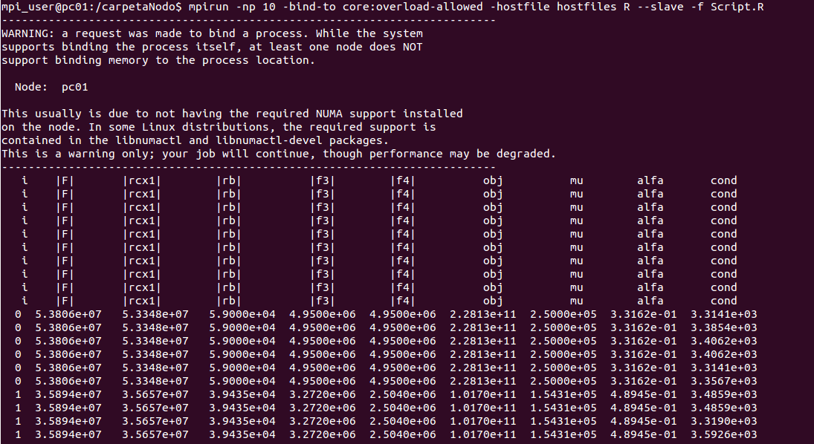
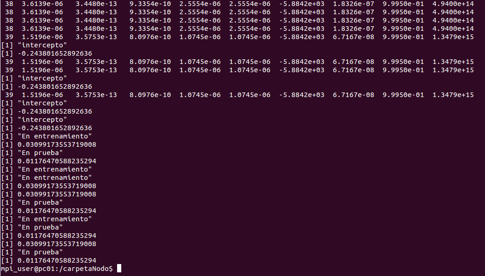
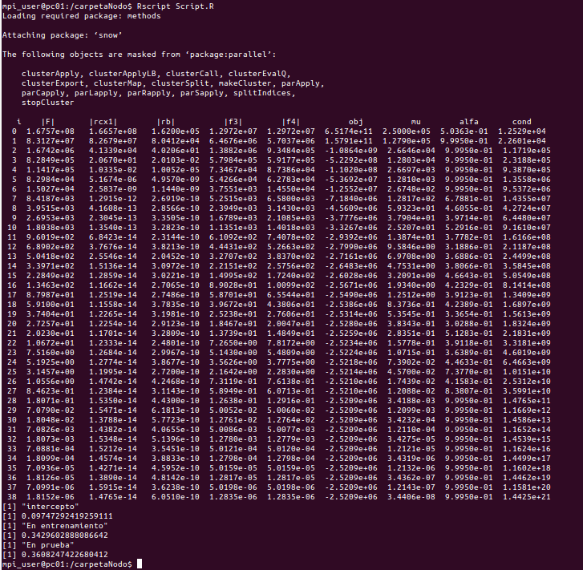
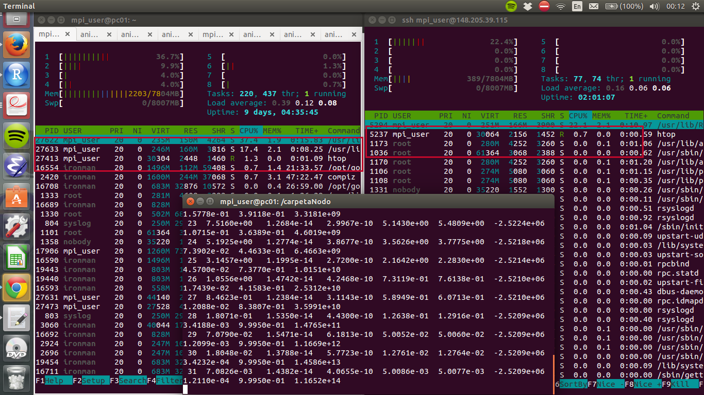

```{r, echo=FALSE, message=FALSE, warning=FALSE}
library(glmnet)
library(caret)
library(knitr)
library(dplyr)
library(tidyr)
library(ggplot2)
library(lubridate)
library(stringr)
knitr::opts_chunk$set(warning=FALSE, cache=TRUE, echo=FALSE)
```

#Análisis Exploratorio de Datos

```{r, message=FALSE}
data <- read.csv("./data/EDA.csv", stringsAsFactors=FALSE)

tamaño_m <- 4750*.7
set.seed(130888)
data_train <- sample_n(data, tamaño_m)
data_test <- anti_join(data, data_train)
```


México ha tenido un incremento en los costos económicos de desastres asociados a fenómenos hidrometeorológicos, huracanes e inundaciones, entre otros. En 2010 se presentaron las mayores pérdidas económicas en la historia del país por fenómenos hidrometeorológicos y geológicos; en total se perdió el 0.8% del PIB y se estima que, una vez calculado en su totalidad, el daño por las tormentas tropicales Ingrid y Manuel en 2013 supere los valores anteriores.

Una pregunta clave que todavía no se contesta en México es si este incremento en daños y pérdidas se debe a un cambio en la distribución de los desastres o a observaciones atípicas. El Sistema de Protección Civil (SINAPROC) define desastre “al resultado de la ocurrencia de uno o más agentes perturbadores severos y o extremos, concatenados o no, de origen natural o de la actividad humana, que cuando acontecen en un tiempo y en una zona determinada, causan daños y que por su magnitud exceden la capacidad de respuesta de la comunidad afectada”; sin embargo no esta definida qué es la capacidad de respuesta de la comunidad afectada ni existen indicadores. Nuestro sistema es reactivo y las reglas de operación no son muy claras. EL Panel Intergubernamental de Cambio Climático (IPCC) prevee un aumento en la frecuencia e intensidad de los desastres hidrometeoroógicos debido al cambio climático.

Actualmente el SINAPROC funciona de la siguiente manera: cuando ocurre un desastre el Gobierno Estatal solicita una evaluación al Gobierno Federal. Este a su vez solicita al Servicio Meteorológico Nacional (SMN), al Sismológico, Comisión Nacional Forestal (CONAFOR) o al Centro Nacional de Prevención de Desastres (CENAPRED), dependiendo el tipo de desastre, la corroboración del evento. Una vez corroborado el Gobierno Federal decide si lo declara o no . Si lo declara tiene tres opciones: Contingencia Climática, Desastre, Emergencia o una combinación de las últimas dos. Esta declaratoria hace toda la diferencia ya que si no es declarado, el evento solo recibe ayuda de protección civil local. Por el contario si lo declaran desastre (contingencia climatica, desastre o emergencia) se activa el programa de reconstrucción del FONDEN, el programa de apoyos de SAGARPA (CADENA) y diversos programas de apoyo social como el programa de Empleo Temporal de SEDESOL. Es por ello que es tan importante tener reglas claras. Este proyecto busca clarificar las reglas del proceso de declaratoria de desastres naturales y encontrar un modelo que ayude al Gobierno Federal acelerar los procesos de decalratoria, ya que actuar de manera oportuna es vital.

Los datos fueron obtenidos del Centro Nacional de Prevención de Desastres (CENAPRED) para los desastres Hidrometeorológicos de 2000-2010. La base se llama Impacto Socio Económico y es con la que realizan la serie anual de los libros con el mismo nombre. Se unió con la base Marginación de CONEVAL y con una base de Riesgos realizada por el Centro Mario Molina (CMM). La base de Riesgos fue realizada para 5 peligros (huracán, inundación, sequía, incendio forestal, deslave) calculados a partir de las características geofísicas del país y las tasas de retorno de los desastres.

##Descripción del Dataset

La base se conforma de 25 variables, entre las cuales hay  características geográficas (riesgos), características socioeconómicas de la población y características del evento.

\begin{figure}[H]
\centering
\includegraphics[width=0.45\textwidth]{img/var.png}
\caption{Descripción de variables en la base de datos.}

\end{figure}

```{r, echo=F, error=F}
#tbl_df(data)
#sapply(data, class)
```

Se dividió el conjunto de datos (4750 observaciones con 25 variables) en datos de entrenamiento (70%) y de prueba (30%).  La distribución por Grado de Marginación nos muestra que los grados altos tienen mas declaratorias. 

\begin{figure}[H]
\centering
\includegraphics[width=0.8\textwidth]{img/dec_GM.png}
\caption{Distribución por grado de marginación.}

\end{figure}

En cuanto al tipo de fenómeno  la mayor parte de las declaratorias se concentran en lluvias y sequías.

\begin{figure}[H]
\centering
\includegraphics[width=0.8\textwidth]{img/tipo.png}
\caption{Distribución por tipo de fenómeno.}

\end{figure}

```{r, echo=F, error=F, message=F, fig.cap="Municipios con desastres.", fig.pos="H"}
ggplot(data=data, aes(x=a_o, y=Dependiente)) +
    geom_bar(colour="blue", stat="identity")+
  labs( title="No. Municipios con Desastres" )+
  xlab('Año')
```


```{r}
train <- read.csv('./data/desastres_train.csv', colClasses=c('factor', rep('numeric', 18)))
test <- read.csv('./data/desastres_test.csv', colClasses=c('factor', rep('numeric', 18)))
```

#Modelos de clasificación

A continuación se presentan los resultados de los dos clasificadores utilizados para los datos: regresión logística regularizada y máquina de soporte vectorial.

##Regresión Logística Regularizada

Se utilizó el método de *elastic net*, que es una regresión logística con más parámetros de regularización. Estos parámetros se escogen a través de validación cruzada.

```{r, eval=FALSE}
mod.1 <- cv.glmnet(x = as.matrix(train[,-1]), y = train$Dependiente, alpha=0.5, family='binomial')
save(mod.1, file='./data/mod.1.RData')
```

```{r, warning=F, error=F, message=F}
load('./data/mod.1.RData')
predicted.glm <- predict(mod.1, as.matrix(test[,-1]), type="response")
predicted.class <- as.factor(predicted.glm>0.5)
levels(predicted.class) <- c(0,1)
cm <- confusionMatrix(predicted.class, test$Dependiente)
kable(cm$table, caption = 'Matriz de confusión de regresión logística')
kable(as.data.frame(cm$byClass), caption="Evaluación del modelo.")
```

La tasa de clasificación de incorrectos fue de 0.38, la matriz de confusión se puede ver en el cuadro 4.

##Máquina de Soporte Vectorial en Paralelo

```{r, fig.cap="Iteraciones y el número de condición.", fig.pos="H"}
source('./src/Script_Desastres.R')

cm2 <- confusionMatrix(as.numeric(y_prueba), b_prueba)
kable(cm2$table, caption = 'Matriz de confusión de SVM')
```
```{r}
kable(as.data.frame(cm2$byClass))
```
```{r}
monitoreo <- resPI[[7]]
monitoreo$i <- as.integer(monitoreo$i)
monitoreo$cond <- as.numeric(monitoreo$cond)
ggplot(monitoreo) + geom_point(aes(x=i, y=cond)) + xlab('Iteración') + ylab('Número de condición')
```

Los resultados de clasificación con la máquina de soporte vectorial fueron mejores que con la regresión logística regularizada. La tasa de clasificación fue menor.

# Problemas 

Durante la elaboración de este proyecto nos enfrentamos a diversos problemas. 

## Implementación del Cluster 

No entendíamos cómo funcionaba el NFS server: 

- Al utilizar dos carpetas con nombres distintos, es decir `mirrorNFS` y `carpetaNodo`, no sabíamos que era necesario cerrar el loop y correr `mpirun` en el master desde `carpetaNodo`.
- Cuando intentamos tener un cluster en nuestras computadoras, con las diferentes versiones y distribuciones de Linux y una computadora MAC, había muchos errores. 
- La versión de MPI se actualizó mientras hacíamos las tareas y con un `update` tuvimos que desinstalar y reinstalar todo de nuevo.
- En realidad, todos los problemas por el NFS se solucionaron cuando entendimos que éste era solamente una manera de pegarle al master los esclavos pero que master siempre considera que está corriendo todo en sus versiones.

Compilación de archivos:

- Las librerías de Lapack, ATLAS, BLAS y las librerías de matemáticas no se cargan en `mpicc` automáticamente para la distribución de Linux que usamos (Ubuntu, 14.04, unity). Nos tardamos mucho en entender los mensajes de compilación.
- En general, aprender a utilizar `c` para adaptar los códigos en la tarea 3 fue muy problemático.

## Paralelización de SVM

- Nos pasó lo mismo que con `mpi`: la versión y localización de `R` en `master` y en cada uno de los `nodos` debe ser exactamente la misma para todas las computadoras en el cluster.
- La instalación de `rmpi` es muy problemática. Debes de realizar^[Gracias al equipo de Liliana, Gabriel y David.]:

```
sudo apt-get install libcr-dev mpich2 mpich2-doc
R
install.packages('Rmpi')
install.packages('snow')
```

- Primero, intentamos con `Rmpi`. Sin embargo, fue muy difícil debuggear e intentar paralelizar el proceso. Lo que nos pasaba es que podíamos prender el cluster en el master pero freezeaba. Cuando leimos diferentes foros de ayuda, resultó que este es uno de los errores más comunes pero puede tener muchas causas. Eventualmente, al poner la bandera de `manual=T` en el comando para iniciar el cluster, si se podía pero teníamos que ir a cada nodo y ejecutar el `script` de `R` generado en cada uno. Esto no escala.
- Después, logramos correrlo en mpi. Sin embargo, no sabíamos porqué estaba repitiendose el proceso tantas veces como procesadores teníamos.





- Probamos muchísimas cosas y nada funcionaba. Entonces, decidimos mejor tirar a la basura y cambiar de estrategia.

- Lo que nos funcionó mejor fue utilizar `snow` directo y mejor controlar el cluster desde ahí. Un ejemplo funcional para prenderlo de manera interactiva fue (con una sesión en R en `carpetaNodo` en el master):

```{r, eval=F, echo=TRUE}
library(snow)
# Prendes el cluster
cl <- makeSOCKcluster(c("slave05","localhost"))
# clusterApply funciona como apply pero mandas el objeto cluster, 
# x *para iterar*, la funcion(suma, para ejemplificar) y parametros adicionales
clusterApply(cl, 1:2, get("+"), 3)
# clusterEvalQ permite enviar comandos a ejecutar en cada nodo para la 
# sesion de R abierta en cada uno
clusterEvalQ(cl, library(boot))
# detenemos el cluster
stopCluster(cl)
```

- Para poder conectar bien snow, el único cambio que hay que realizar es completar la conexión de dos vías entre master y esclavos, es decir, que todos vean a todos con el mismo alias. Por ejemplo, en la master (pc01) y en el esclavo (pc05):


- Esta forma nos permitió dejar de utilizar `mpirun` y poder manipular el cluster desde `R`. Por esto, al final el llamado a svm en paralelo es vía `Rscript`, desde el master y en `carpetaNodo`:

```
Rscript Script.R
```

Los resultados se muestran a continuación



Para revisar que el trabajo se estaba realizando en master y en nodos, prendimos un `htop` en el master y el esclavo:


