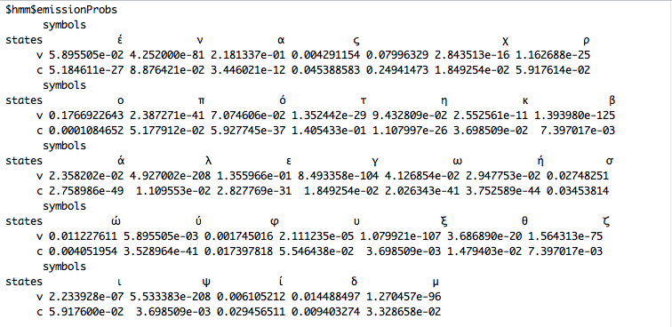

```{r, echo=F, message=F, error=F, warning=F}
# bibliografia
library(knitr)
library(knitcitations)
library(bibtex)
library("RefManageR")

cleanbib()
cite_options(hyperlink=T)
bib <- read.bibtex("bibliografia_hmm.bib")
```

\pagebreak

# Introducción 

Los modelos de HMM son modelos estadísticos que se utilizan en procesos que se suponen Markovianos donde los estados no son visibles directamente —son latentes— pero las variables influidas por estos estados si lo son. El objetivo consiste en identificar estos estados ocultos para conocer los estados, las transiciones entre los estados y las probabilidades de cada estado sobre las variables a las que influyen. 


Los HMM han sido ampliamente utilizados en problemas de Procesamiento de Lenguaje Natural (NLP) sobre todo para el reconocimiento del habla (Part Of Speech, POS), etiquetado gramatical, reconocimiento de escritura manual, etc. `r citet(bib["stamp12"])`

# Objetivo

Identificación de vocales y consonantes de un texto en español a través de un modelo de HMM estimando sus parámetros.


# Especificación del modelo

* Utilizamos HMM con el algoritmo Baum-Welch para estimar los parámetros:

1. las probabilidades inciales de los estados
2. las probabilidades de transición entre estados 
3. las probabilidades de cada símbolo de pertenecer a uno de los estados 


## Algoritmo Baum-Welch

* Este algoritmo es una variante del EM visto en clase `r citet(bib[c("frazzoli10", "bilmes98")])` . Iniciamos con un modelo sin 'conocimiento' 

$\pi$ = probabilidades de iniciar en cada estado

T= matriz de transición de estados

M= matriz de emisiones

$\lambda=(T,M,\pi)$

* En cada iteración los valores de $\pi$, A y B se van actualizando hasta convergencia implementando el algoritmo forward-backward. 


Definimos $\gamma_{k}(s)=Pr[X_{k}= s|Z,\lambda]$, la probabilidad de que el sistema se encuentre en el estado $s$ en el $k$-ésimo tiempo, dada la secuencia de observaciones $Z$ en el modelo $\lambda$ (forward-process).

$\gamma_{k}(s)=\frac{\alpha_{k}(s)\beta_{k}(s)}{Pr[Z|\lambda]}=\alpha_{k}(s)\beta_{k}(s){\sum_{s\epsilon\chi}\alpha_{t}(s)}$

Definimos $\xi_{k}(q,s)=Pr[X_{k}=q,X_{k+1}=s|Z,\lambda]$, la probabilidad de estar en el estado $q$ al tiempo $k$ y en el estado $s$ en el tiempo $k+1$ dada la secuencia de observaciones en el modelo actual de HMM (backward-process).

$\xi_{k}(q,s)=\eta_{k}\alpha_{k}(q)T_{q,s}M_{s,z_{k+1}}\beta_{k+1}(s)$, donde $\eta_{k}$ es un factor de normalización tal que $\sum_{q,s}\xi_{k}(q,s)=1$

Calculando $\gamma_{k}(s)$ y $\xi_{k}(q,s)$ podemos actualizar el modelo $\lambda'=(T',M',\pi')$

$\pi'_{s}=\gamma_{1}(s)$

$T'_{q,s}=\frac{E[\#\phantom{a}de\phantom{a}transiciones\phantom{a}del\phantom{a}estado\phantom{a}q \phantom{a}al\phantom{a}s]}{E[\#\phantom{a}de\phantom{a}transiciones\phantom{a}del\phantom{a}estado\phantom{a}q]}=\frac{\sum_{k=1}^{t-1}\xi_{k(q,s)}}{\sum_{k=1}^{t-1}\gamma_{k}(q)}$

$M'_{s,m}=\frac{E[\#\phantom{a}de\phantom{a}veces\phantom{a}en\phantom{a}el\phantom{a}estado\phantom{a}s\phantom{a}cuando\phantom{a}la\phantom{a}observacion\phantom{a}fue\phantom{a}m]}{E[\# de veces en el estado s]}=\frac{\sum_{k=1}{t}\gamma_{k}(s)1(z_{k}=m)}{\sum_{k=1}^{t}\gamma_{k}(s)}$

## Suposiciones iniciales del modelo

* Nuestra base será suponer que existen 2 estados: **Consonante** y **Vocal**  
* No conocemos con qué probabilidad de inicio estamos en Constante o en Vocal
* No conocemos las probabilidades de transición entre estados 
* No conocemos las probabilidades de que cada símbolo del lenguaje pertenezca a uno de los estados


# Datos 

Intentamos ocupar los últimos 100 contenidos publicados en Quién.com y CNNExpansión.com sin embargo sus corpus requieren de mucho de preprocesamiento para eliminar encoding y caracteres extraños.

Decidimos tomar un corpus en español de un ejercicio realizado en Métodos Analíticos correspondiente a un periodico español con 309,918 noticias  

## Limpieza de Datos 

* Eliminamos signos de puntuación
* Eliminamos dígitos
* Eliminamos tabulaciones
* Cambiamos todo el corpus a minúsculas
* Dividimos cada palabra en sus letras respetando los espacios


# Metodología

1. Limpieza de datos
2. Separar cada palabra en sus respectivas letras respetando espacios
3. Establecemos nuestro conocimiento a priori sobre las probabilidades iniciales de estados inicializando $\pi$. Dado que no conocemos mucho del proceso las establecemos muy cercanas a 0.5 (suman a 1)
4. Establecemos nuestro conocimiento a priori sobre las probabilidades de transición entre estados inicializando A. Dado que no conocemos mucho del proceso las establecemos cercanas a 0.5 pero agregando que creemos que es más probable la transición de vocal a consonante que de vocal a vocal, al igual que de consonante a vocal de que de consontante a consonante. 
5. Establecemos nuestro conocimiento a priori sobre las probabilidades de cada símbolo a cada uno de los estados propuestos inicializando B. Dado que no conocemos mucho del proceso las establecemos dividiendo 1 entre el número de símbolos posibles en el set de datos. 
6. Inicialización de la HMM con los parámetros establecidos en el paso 4,5 y 6.
7. Correr el algoritmo de Baum-Welch

# Paquetes utlizadas

* Paquete HMM de R `r citet(bib["hmm"])`

* Algoritmo de Baum-Welch para estimación de parámetros de una HMM

# Resultados Español

Inicial sin conocimiento:

||V|C|
|:---:|:---:|:---:|
||0.5337|0.4662|


Inicial después de Baum-Welch

||V|C|
|:---:|:---:|:---:|
||0.5337|0.4662|


Transiciones sin conocimiento

||V|C|
|:---:|:---:|:---:|
|V| 0.3099|0.6900|
|C|0.5200|0.4799|

Transiciones después de Baum-Welch

||V|C|
|:---:|:---:|:---:|
|V| 0.3045|0.6954|
|C|0.993|0.006|

A continuación se identifican que las probabilides en el estado *v* de los símbolos *a, e, i, o, u, ú* son mayores que las probabilidades de estos símbolos al estado *c*. De igual forma, las probabilidades en el estado *c* para los símbolos que **no** son *a, e, i, o, u, ú* son mayores que las probabilidades de estos símbolos al estado *v*. 


# Resultados Griego 

Inicial sin conocimiento:

||V|C|
|:---:|:---:|:---:|
||0.53765|0.4234|


Inicial después de Baum-Welch

||V|C|
|:---:|:---:|:---:|
||0.6117|0.3882|


Transiciones sin conocimiento

||V|C|
|:---:|:---:|:---:|
|V|0.3558|0.6441|
|C|0.5161|0.4838|

Transiciones después de Baum-Welch

||V|C|
|:---:|:---:|:---:|
|V|0.0093|0.9906|
|C|0.6178|0.3821|

En griego las vocales corresponden a los símbolos:

|Griego | Vocal|
|:---:|:---:|
| A,$\alpha$|a|
|E,$\epsilon$|e|
|I,$\iota$|i|
|O,$\omicron$|o|
|Y,$\upsilon$|u|

A continuación se identifican que las probabilides en el estado *v* de los símbolos $\alpha$,$\epsilon$,$\iota$,$\omicron$,$\upsilon$,$\epsilon$ acentuado, son mayores que las probabilidades de estos símbolos al estado *c*. De igual forma, las probabilidades en el estado *c* para los símbolos que **no** son $\alpha$,$\epsilon$,$\iota$,$\omicron$,$\upsilon$,$\epsilon$ acentuado son mayores que las probabilidades de estos símbolos al estado *v*. 




\pagebreak

# Código

## Español
```{r eval=FALSE}
library(HMM)

periodico <- scan(file='./datos/Es_Newspapers.txt', sep="\n", what = character())

#limpieza de datos
for(i in 1:length(periodico)) {
  periodico[i] <- gsub("[[:punct:]]","",unlist(periodico[i]))
  periodico[i] <- gsub("[[:digit:]]","",unlist(periodico[i]))
  periodico[i] <- tolower(periodico[i])
  periodico[i] <- gsub("[[:space:]]"," ",unlist(periodico[i]))
}


#separando a letras
for (i in 1) {
  texto <- periodico[i]
  if(i == 1){
    obsv <- as.data.frame(unlist(strsplit(texto, split="")), stringsAsFactors=FALSE)
  } else {
    obsv <- rbind(obsv, as.data.frame(unlist(strsplit(texto, split="")), stringsAsFactors=FALSE))
  }
}
names(obsv) <- "letter"


states = c("v","c")
symbols = c("a","b","c","d","e","f","g","h","i","j","k","l","m","n","o","p","q","r",
            "s","t","u","v","w","x","y","z"," ","á","é","í","ó","ú","ñ")
#probabilidades iniciales de lso estados
random_num <- runif(1,0.5,0.7)
startProbs = matrix(c(random_num, 1-random_num), 2)

random_num <- runif(1, 0.5,0.7)
random_num_2 <- runif(1, 0.5,0.7)
transProbs <- matrix(c(1-random_num, random_num_2, 
                       random_num, 1-random_num_2), 2)
  
random_nums <- data.frame(runif(33,0.030,0.034), runif(33,0.030,0.034))
random_nums <- data.frame(rep(1/33,33), rep(1/33,33))
emissionProbs=as.matrix(random_nums)
inithmm <- initHMM(states, symbols, startProbs=startProbs, transProbs=transProbs, 
                   emissionProbs=emissionProbs)
bw <- baumWelch(inithmm, obsv$letter)
bw
```

## Griego

```{r eval=FALSE}
library(HMM)

setwd("/Users/Lili/Documents/itam/estadistica_multivariada_y_datos_categoricos/examenes/final")


periodico <- scan(file='griego_test.txt', sep="\n", what = character())


for(i in 1:length(periodico)) {
  periodico[i] <- gsub("[[:punct:]]","",unlist(periodico[i]))
  periodico[i] <- gsub("[[:digit:]]","",unlist(periodico[i]))
  periodico[i] <- tolower(periodico[i])
  periodico[i] <- gsub("[[:space:]]"," ",unlist(periodico[i]))
}


for (i in 1) {
  texto <- periodico[i]
  if(i == 1){
    obsv <- as.data.frame(unlist(strsplit(texto, split="")), stringsAsFactors=FALSE)
  } else {
    obsv <- rbind(obsv, as.data.frame(unlist(strsplit(texto, split="")), stringsAsFactors=FALSE))
  }
}
names(obsv) <- "letter"

#obsv <- obsv[-which(obsv$letter=="¾"),]
#obsv <- obsv[-which(obsv == "å")]

states = c("v","c")
symbols = c("έ","ν","α","ς"," ","χ","ρ","ο","π","ό","τ","η","κ","β","ά","λ","ε","γ","ω","ή","σ","ώ","ύ","φ","υ"
            ,"ξ","θ","ζ","ι","ψ","ί","δ","μ")
#probabilidades iniciales de lso estados
random_num <- runif(1,0.5,0.7)
startProbs = matrix(c(random_num, 1-random_num), 2)

random_num <- runif(1, 0.5,0.7)
random_num_2 <- runif(1, 0.5,0.7)
transProbs <- matrix(c(1-random_num,random_num_2,  
                       random_num,1-random_num_2), 2)
  
#random_nums <- data.frame(runif(31,0.030,0.034), runif(33,0.030,0.034))
random_nums <- data.frame(rep(1/length(symbols),length(symbols)), rep(1/length(symbols),length(symbols)))
emissionProbs=as.matrix(random_nums)
inithmm <- initHMM(states, symbols, startProbs=startProbs, transProbs=transProbs, 
                   emissionProbs=emissionProbs)
bw <- baumWelch(inithmm, obsv$letter)
bw
```


\pagebreak

# Bibliografía


