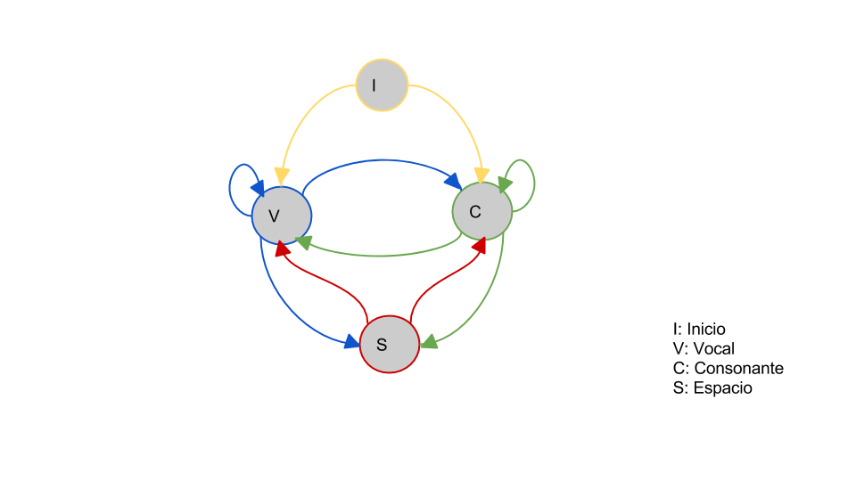

# Aplicación 1: Modelo de reconocimiento de vocales


## Problema 

Supongamos que somos alienígenas de Las Pléyades y que no tenemos ni idea de cómo se 'lee' un lenguaje de la tierra, no sabemos de los idiomas pero como somos seres superiores sabemos de Hidden Markov Models! 

* Objetivo: 

Queremos establecer ciertas propiedades de este lenguaje que no conocemos, veremos que al identificar estas propiedades, de manera *natural* identificaremos las vocales de las consonantes.  


## Especificación del modelo

* Utilizamos HMM con el algoritmo Baum-Welch para estimar los parámetros:

1. las probabilidades inciales de los estados
2. las probabilidades de transición entre estados 
3. las probabilidades de cada símbolo de pertenecer a uno de los estados 

* Únicamente con la evidencia que tienen los datos (nuestras observaciones)

## Baum-Welch

* Este algoritmo es una variante del EM visto en clase. Iniciamos con un modelo sin 'conocimiento' 

$\pi$ = probabilidades de inciar en cada estado

A= matriz de transición de estados

B= matriz de emisiones

$\lambda=(A,B,\pi)$

* En cada iteración los valores de $\pi$, A y B se van actualizando hasta convergencia
* El algoritmo ocupa el forward procedure —probabilidad de ver esta secuencia parcial y terminar en el estado i en el tiempo t— y el backward procedure —probabilidad de terminar en la esta secuencia parcial dado que empezamos en el estado i en el tiempo t—


## Datos 

* Tomamos el corpus de noticias de un periódico español
* 309,918 noticias

## Limpieza de datos 

* Eliminación de signos de puntuación 
* Eliminación de dígitos
* Eliminación de tabuladores
* Todas las letras a minúsculas
* Cada palabra es separada en sus letras respetando los espacios


## Suposiciones iniciales del modelo

* Nuestra base será suponer que existen 2 estados: **Consonante** y **Vocal**  

* No conocemos con qué probabilidad de inicio estamos en Constante o en Vocal

* No conocemos las probabilidades de transición entre estados 

* No conocemos las probabilidades de que cada símbolo del lenguaje pertenezca a uno de los estados

## Modelo



## Paquetes utlizadas

* Paquete HMM de R

* Algoritmo de Baum-Welch para estimación de parámetros de una HMM

## Resultados

Inicial sin conocimiento:

||V|C|
|:---:|:---:|:---:|
||0.5337|0.4662|


Inicial después de Baum-Welch

||V|C|
|:---:|:---:|:---:|
||0.5337|0.4662|


## Resultados

Transiciones sin conocimiento

||V|C|
|:---:|:---:|:---:|
|V| 0.3099|0.6900|
|C|0.5200|0.4799|

Transiciones después de Baum-Welch

||V|C|
|:---:|:---:|:---:|
|V| 0.3045|0.6954|
|C|0.993|0.006|

## Resultados


# Aplicación 2: Modelos jerárquicos y postestratificación

## Problema 

¿Cómo realizar inferencia sobre la población objetivo con datos de encuesta recabados con un diseño no probabilístico basado en cuotas y sin marco muestral?

### Objetivo

- Generar estimaciones precisas y confiables
- Controlar por sesgo de selección

## Un poco de teoría de encuestas

### Tipos de errores de encuestas

- Error de cobertura
- Error de muestreo
- Errores por no respuesta
- Errores de medición

### Tipos de muestreo

- Probabilístico
- No probabilístico

## No probabilístico por cuotas

**Problema principal**: sesgo de selección. 

$\Rightarrow$ Para hacer inferencias acerca de la población a partir de una muestra de este tipo es necesario suponer que las personas que fueron seleccionadas son similares a las que no lo fueron...

**Soluciones posibles:**

- Sample matching
- Máximo entropía
- MRP

## Especificación del modelo: pre MR

Se denotará al estimador por este método como $\tilde{\theta}$ y se obtiene con el siguiente proceso:

1. Identificación de una o más variables que pueden ser responsables del sesgo de selección. SPG, la cuadrícula completa de clasificación se trata como una única variable categórica $G$.

**Limitación**: Con los datos de INEGI a nivel manzana solo podemos especificar 5 modelos

- Edad x colonia
- Condición de ocupación x colonia
- Escolaridad x colonia
- Género x edad x colonia
- Condición de ocupación x género x colonia

## ¿Cómo se ven los datos?

```{r, echo=F, error=F, message=F, warning=F, results='hide'}
library(knitr)
library(dplyr)
## Cargo datos: se utilizan los codigos que se mostraron en el paso 1
source("../mrp/src/clean_census.r", chdir=T)
source("../mrp/src/clean_encuesta.r", chdir=T)
```

**Datos del censo**

- Cuadricula: colonia x genero x edad
- Dimensiones: 63 x 2 x 4 = `r dim(mod.4)[1]`

`r kable(head(mod.4))`

## ¿Cómo se ven los datos?

**Datos de encuestas**

- Datos individuales con las respuestas a los cuestionarios.
- Las variables elegidas para $G$ se recodifican *igualito* al censo.
- La variable de interés en 0 y 1.
- Morelos 2013: `r dim(mor_13)[1]`
- Morelos 2014: `r dim(mor_14)[1]`

`r kable(head(select(mor_13, idcolonia, genero, edad, victimizacion), n=4))`

## Especificación del modelo: el MR

2. Se define un nuevo estimador $\gamma \equiv E(Y|D=d, G=g), d=1,...,J, g=1,...,G$.
3. Se utiliza un modelo de regresión multinivel apropiadamente especificado para estimar $\gamma$.

## Especificación del modelo: el P

4. El paso de postestratificación utiliza el modelo generado en el paso 3. Se computa el estimador MRP para cada elemento $\theta_d$ de $\theta$ como la suma ponderada del subconjunto apropiado de $\hat{\gamma}$.

\[
\tilde{\theta_d} = \sum_{g=1}^{G} \hat{\gamma_{d,g}} w_{g|d}
\]

donde $w_{g|d}=\frac{N_{g,d}}{N_d}$. El numerador es el número de miembros de la población objetivo que pertenecen simultáneamente a la categoría $g$ y $d$. El denominador es el número de miembros en la población objetivo que pertenecen a la categoría $d$.


## Resultados

Muestras no comparables, ¡ahora lo son!

```{r, echo=F, message=F, error=F, warning=F}
load("../mrp/data/comparacion1.rdata")
kable(comparacion)
```

## MRP

**Resuelve:** small area estimation y/o selection bias

**Ventajas del método**

- El uso de la regresión multinivel incrementa la precisión del estimador.
- Si $G$ se define adecuadamente, la postestratificación ayuda a decrecer el error por sesgo de selección.
- MRP es un estimador relativamente preciso para $\theta$.

**Desventajas del método**

- Se necesitan datos poblacionales para toda la clasificación $DxG$ lo cuál limita la definición de $G$.
- Para obtener buenos estimadores de $\gamma$, el modelo de regresión multinivel debe ser especificado con mucho cuidado. Sin embargo, esta limitación aplica para cualquier modelo.


