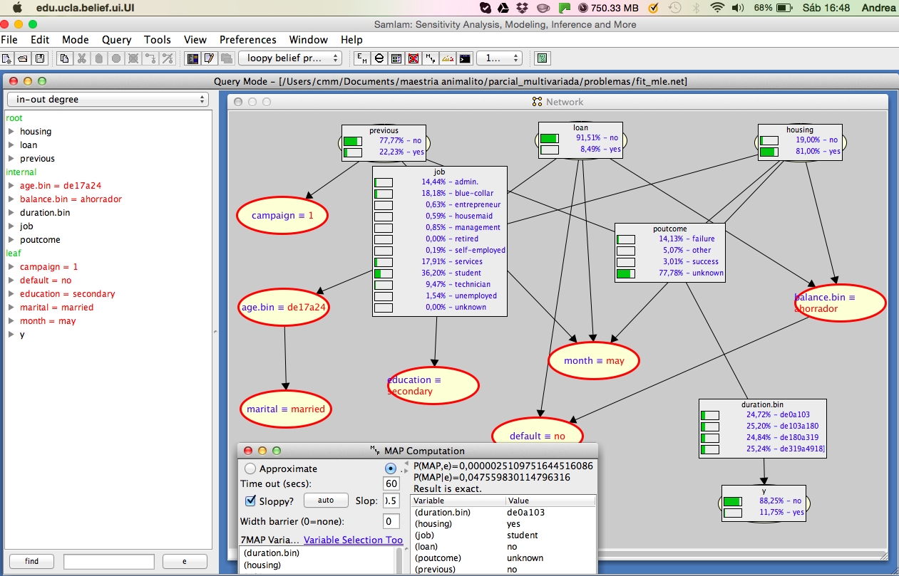

Instrucciones: Se trabajará en equipos de 2, entregando un reporte por equipo y
la red en samiam. El reporte debe explicar claramente las respuestas e incluir
el código. Esta prohibido discutir con otros equipos.
Descripción de la base de datos

Los datos (mkt.Rdata) están relacionados con las campañas de marketing de una 
institución bancaria de Portugal. Abarca 17 campañas que ocurrieron entre mayo 
2008 y noviembre 2010, las campañas consisten en llamadas a clientes sumando 
45,211 contactos (la base de datos incluída es un subconjunto con 40,690). En 
las llamadas se ofrecía un contrato a largo plazo para invertir dinero, con 
tasas de interés atractivas (de acuerdo al banco). En cada contacto se 
registraban 16 atributos que incluyen la respuesta del cliente, esto es si el
cliente contrató el producto.

```{r, echo=FALSE, warning=FALSE, message=FALSE}
options(digits=4)
options(scipen=999)
source('src/load_libraries.r', chdir=T)
```


Las variables son las siguientes:


La institución bancaria quisiera conocer como están relacionadas estas variables,
en particular, quisieran entender la relación con la variable respuesta y.

Utiliza el siguiente código para separar los datos en prueba y entrenamiento:
```{r, eval=F}
load("datos/mkt.Rdata")
set.seed(18937)
mkt_train <- sample_n(mkt, 30000)
mkt_test <- anti_join(mkt, mkt_train)
```

#Preguntas
##1
Aprender estructura (3). Utiliza la muestra de entrenamiento para crear una red 
bayesiana, si es necesario discretiza o transforma las variables. Si consideras 
que algunas variables no son relevantes puedes excluirlas del análisis siempre y 
cuando justifiques tu decisión. Además utiliza la opción blacklist para mejorar 
la coherencia de la red. Por ejemplo, si pensamos en y como variable respuesta 
lo más natural sería que no tenga hijos.

*Describe como dscretizaste las variables.
*Explica tu razonamiento para agregar una whitelist o blacklist.
*Que score elegiste para aprender estructura y por que.

```{r, echo=F, error=F, message=F, warning=F}
out <- NULL
out <- c(out, knit_child('problemas/1.Rmd', quiet = TRUE))
```
`r paste(out, collapse='\n')`

##2
Aprender estructura (3). Con el objetico de crear una red más robusta. Genera
muestras bootstrap (a partir de los datos de entrenamiento), y calcula una red
promedio. Recuerda incluir tu conocimiento experto (whitelists/blacklists).

*Describe cuantas muestras usaste y el umbral que usaste para incluir un arco en
la red promedio.
*¿Cuáles on los arcos con mayor fuerza?
*Refleja la fuerza de los arcos en una gráfica de tu red (usando como medida de
fuerza la correspondiente a la función boot.strength).

```{r, echo=F, error=F, message=F, warning=F}
out <- NULL
out <- c(out, knit_child('problemas/2.Rmd', quiet = TRUE))
```
`r paste(out, collapse='\n')`

##3
Modelos locales (2). Una vez que elegiste la estructura final ajusta los modelos 
locales. Asegurate de que estén bien definidos para todas las variables, es 
decir, si la estimación de máxima verosimilitud no esta definida para alguna
celda (NAs) utiliza un modelo logístico o multinomial o simplemente un 
suavizamiento de los conteos usando tamaño de muestra imaginaria.

*Justifica tu elección de modelo y parámetros, es decir, si usas tamaño de 
muestra imagiario que valor usas o si eliges un modelo logístico que 
interacciones incluyes.
*Substituye las estimaciones en la red por las estimaciones de tus modelos 
locales.
*Para el nodo correspondiente a y realiza gráficas de las probabilidades 
ajustadas con tu modelo y comparalas con las correspondientes a máxima 
verosimilitud.
*Una vez que ajustaste un modelo para el nodo y (con la muestra de entrenamiento)
úsalo para predecir el valor de y en la muestra de prueba.
*Repite las predicciones usando las estimaciones de máxima verosimilitud 
(nuevamente ajustas el modelo con los datos de entrenamiento y predices sobre 
los datos de prueba).
*Puedes usar el predict de la función que estás usando en el modelo local (glm, 
bayesglm, etc.) o predict.grain (ver sección 15 de tutorial, una ventaja de usar 
predict.grain es que puede haber datos faltantes en los predictores y ocupa la 
evidencia existente y la estructura de la red para predecir las variables de 
interés).
*Del conjunto de personas con resultado positivo (y = yes) ¿Qué porcentaje 
clasificas correcto usando cada uno de los dos modelos locales?

```{r, echo=F, error=F, message=F, warning=F}
out <- NULL
out <- c(out, knit_child('problemas/3.Rmd', quiet = TRUE))
```
`r paste(out, collapse='\n')`


##4
Queries de probabilidad condicional (1). Para estos incisos puedes usar gRain o
samiam:

*$p(Y=1) =$
*$p(Y=1|JOB=unemployed, MARITAL=single, EDUCATION=primary) =$
*$p(JOB=admin.|MARITAL=married, EDUCATION=primary, BALANCE=1000) =$

```{r, echo=F, error=F, message=F, warning=F}
out <- NULL
out <- c(out, knit_child('problemas/4.Rmd', quiet = TRUE))
```
`r paste(out, collapse='\n')`

##5

MAP-Maximum a Posteriori (1). Supón que observas evidencia E=e:
$e={AGE=20,MARITAL=married,EDUCATION=secondary,DEFAULT=no,BALANCE=1000,MONTH=may,$
$CAMPAIGN=1}$

Sea $Y=V\ E$, esto es, Y son todas las variables que no están en la evidencia E.

*Para cada variables Yi en Y, ¿cuál es el valor más probable? Es decir,
    $argmaxyip(Yi=yi|E=e)$
*Calcula los valores y de máxima probabilidad posterior $MAP(Y|E=e)$.


Dada la evidencia los resultados son los siguientes: 

 


No he dado ni recibido ayuda no autorizada en la realización de este exámen.


Firmas

Andrea Fernández Conde 

Andrea García Tapia
