```{r, echo=FALSE, warning=FALSE, error=FALSE, message=FALSE, background="black"}
library(knitr)
# Leemos los datos mas recientes
cat <- read.csv('data/catalogo.csv')

# Defino los factores de riesgo en bonito para titulos
fr <- unique(cat$factor_de_riesgo[!is.na(cat$factor_de_riesgo)])
fr <- fr[which(fr!='violencia')]
factores <- list(embarazo_temprano = "Embarazo temprano",
                 marginacion_exclusion_social = "Marginación y exclusión social",
                 falta_oportunidades_laborales_informalidad_desocupacion = "Falta de oportunidades laborales, informalidad y desocupación",
                 espacios_publicos_insuficiente_deteriorado = "Espacios públicos insuficientes y deteriorados",
                 capital_social_participacion_incipiente = "Capital social y participación incipiente",
                 desercion_escolar = "Deserción escolar",
                 consumo_abuso_drogas_ilegales = "Consumo y abuso de drogas legales e ilegales",
                 ambientes_familiares_deteriorados_problematicos = "Ambientes familiares deteriorados y problemáticos")
```

## Introducción {.flexbox .vcenter .background:black}
- Nos interesa modelar la violencia y el delito en el territorio mexicano enfocándonos en las zonas definidas como *prioritarias* y teniendo como base los factores de *riesgo identificados* como precursores de la violencia y el delito. 

## Planteamiento del problema {.flexbox .vcenter}

- A partir de la creación del Programa Nacional para la Prevención Social de la Violencia y la Delincuencia 2014-2018, se ha creado la necesidad de tener un conjunto ordenado de indicadores que permita dar seguimiento, evaluar y generar las recomendaciones necesarias para que año a año se cumpla el objeto de atender los factores de riesgo y de protección vinculados a la violencia y a la delincuencia.

## Factores de Riesgo  {.flexbox .vcenter}
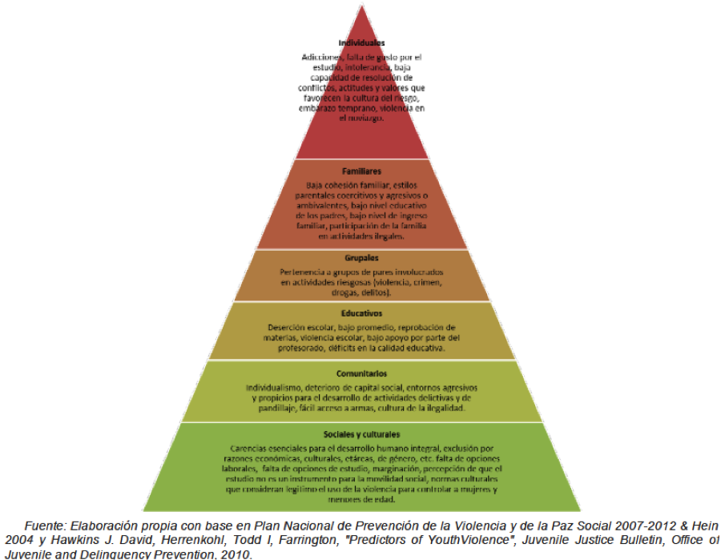

## Factores de Riesgo {.flexbox .vcenter}
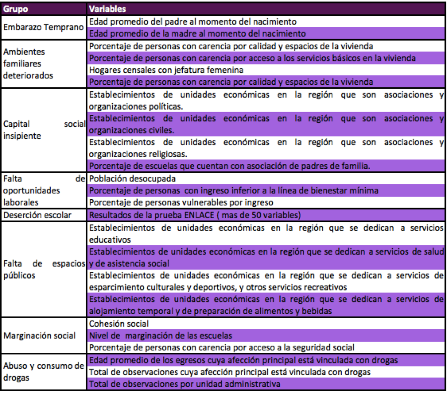


## Objetivo {.flexbox .vcenter}

-El objetivo de este estudio es caracterizar los municipios del país entorno a los diferentes factores de riesgo que el programa busca atender. Además, se busca generar recomendaciones para identificar las buenas prácticas y poder hacer una gestión más eficiente de los recursos del presupuesto federal

## Consulta con Expertos {.flexbox .vcenter}

- México Evalúa 
- COLMEX Dr.Arturo Alvarado 
- CIDE, Dr. Carlos Vilalta

## Fuentes de datos {.flexbox .vcenter}

- CONEVAL: Resago social (censo 2010).
- INEGI: 
    + Censo
    + Encuesta Nacional sobre la Dinaámica de las Relaciones de los Hogares (ENDIREH)
    + Encuesta  Nacional de Victimización y Percepción sobre Seguridad Pública  (ENVIPE) 
    + Directorio Estadístico Nacional de Unidades Económicas (DENUE)
- SEP 
    + Censo educativo (2013).
    + ENLACE (2013).
- Encuesta Nacional de Cultura  Política y Prácticas Ciudadanas (ENCUP, Gob e INEGI).
- Sistema Nacional de Información de Salud (SINAIS)
    + Egresos hospitalarios
    + Recursos de salud
- Secretariado Ejecutivo Sistema Nacional de Seguridad Pública (SESNSP, Variable dependiente).

## Problemas con los datos y modelado. {.flexbox .vcenter}

- Años.
    + De cada fuente de los datos se toma el último año.
- Medición de los factores de riesgo.
- Encuestas
    + Son estatales.
    + A todos los municipios.
    + Considerar el muestreso de los municipios (No es trivial).
- Espacios públicos.
- NA's.
    + Registros admin: 0's.
    + Encuestas: muestreo en todos los mun.
- Enlace:
    + Hay menos registros públicos que los se reportan.

## Correcciones  {.flexbox .vcenter}

- Dadas las recomendaciones de la presentación del anteproyecto se tomo solamente aquellos municipios con poblaciones mayores a los 40 mil habitantes 
- A los registros administrativos censales se les imputo ceros
- Se ajustaron las variables por densidad poblacional

## Correcciones  {.flexbox .vcenter}
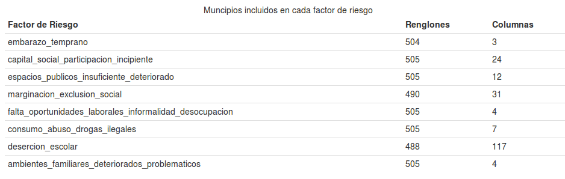

## Correcciones  {.flexbox .vcenter}

    
# Estadística Descriptiva Inicial

```{r, echo=FALSE, warning=FALSE, error=FALSE, message=FALSE, background="black"}
out <- NULL
for (f in names(factores)){
    out <- c(out, knit_child('auxiliares_presentaciones/child_doc_final_mapas.Rmd', quiet = TRUE))
}
```
`r paste(out, collapse='\n')`

## Densidad dependiente {.flexbox .vcenter}
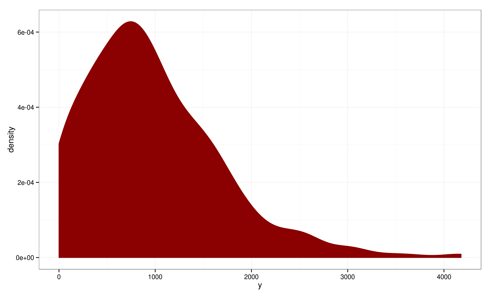

## Outliers {.flexbox .vcenter}
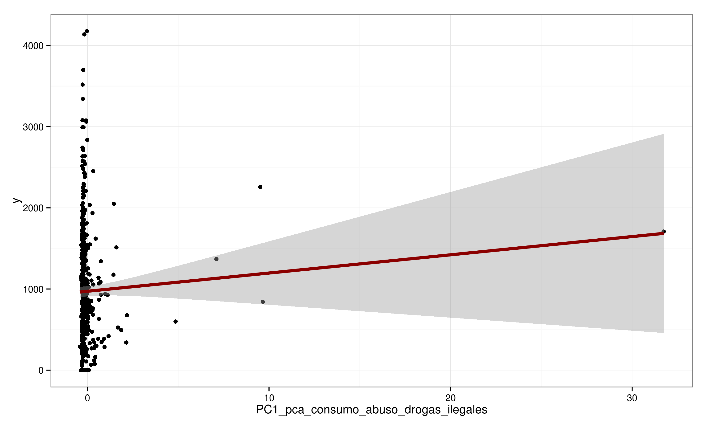

## Outliers {.flexbox .vcenter}


## Outliers {.flexbox .vcenter}


## Outliers {.flexbox .vcenter}
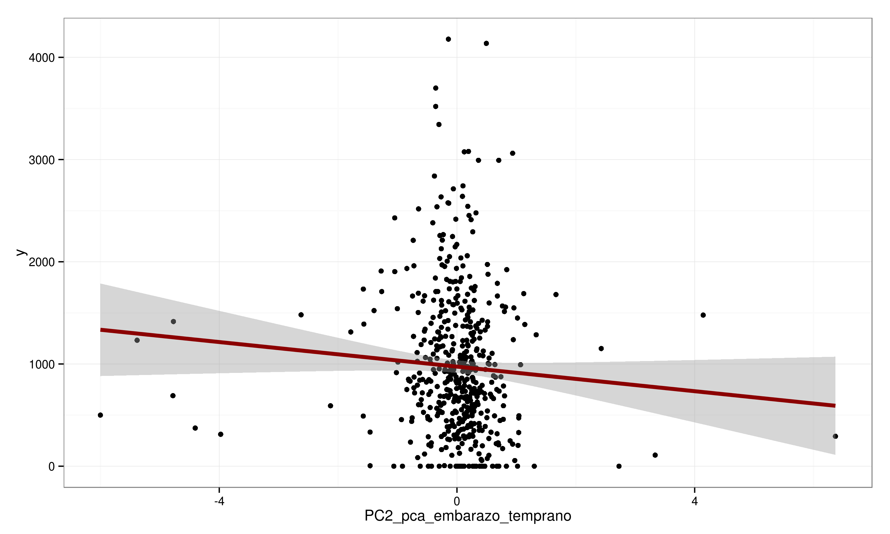

## Outliers {.flexbox .vcenter}
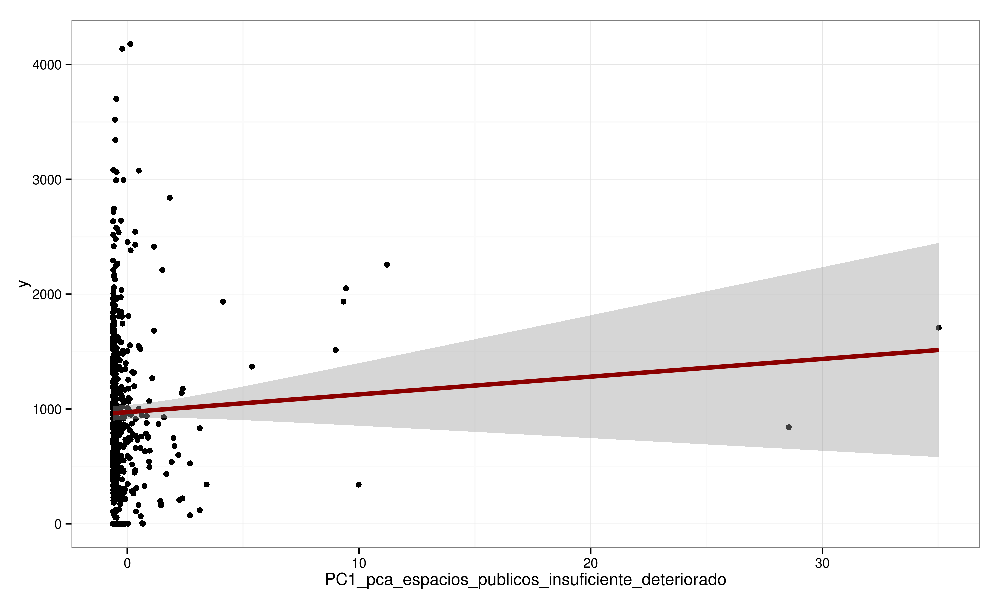

## Outliers {.flexbox .vcenter}


## Outliers {.flexbox .vcenter}
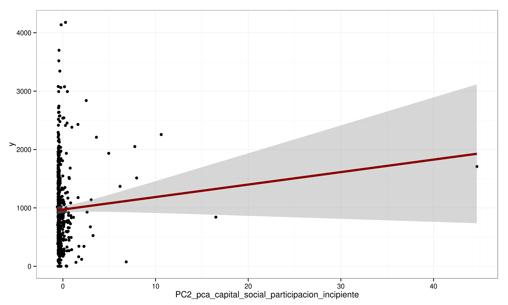

## Factores de riesgo {.flexbox .vcenter}
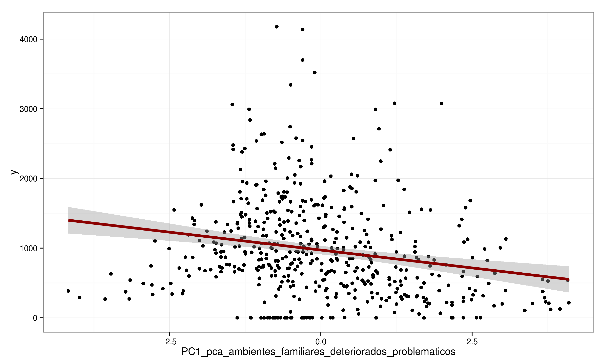

## Factores de riesgo {.flexbox .vcenter}


## Factores de riesgo {.flexbox .vcenter}


## Factores de riesgo {.flexbox .vcenter}
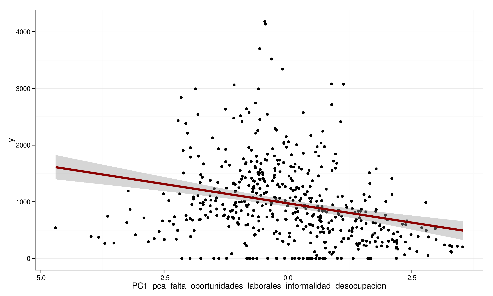

## Factores de riesgo {.flexbox .vcenter}


## Factores de riesgo {.flexbox .vcenter}


## Factores de riesgo {.flexbox .vcenter}
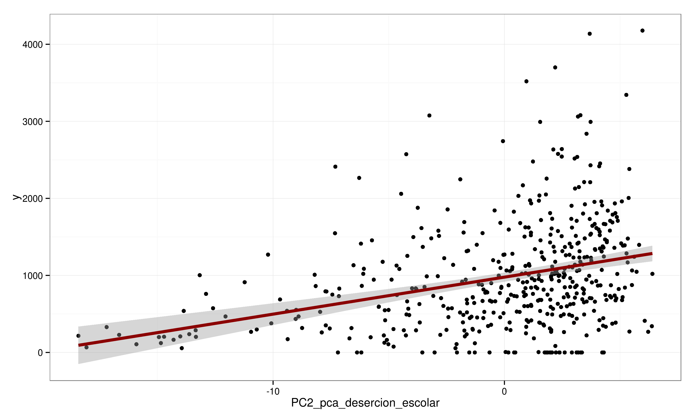

## Factores de riesgo {.flexbox .vcenter}
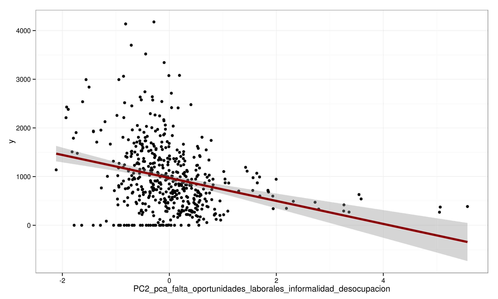

## Factores de riesgo {.flexbox .vcenter}


## Factores de riesgo {.flexbox .vcenter}


## Factores de riesgo {.flexbox .vcenter}
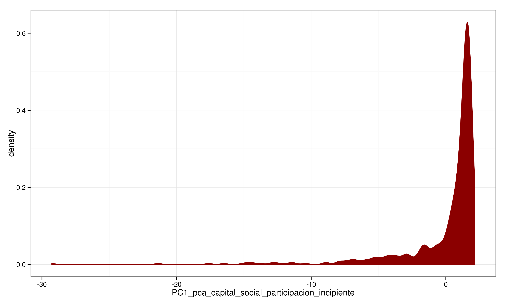

## Factores de riesgo {.flexbox .vcenter}


## Factores de riesgo {.flexbox .vcenter}


## Factores de riesgo {.flexbox .vcenter}


## Factores de riesgo {.flexbox .vcenter}


## Factores de riesgo {.flexbox .vcenter}


## Factores de riesgo {.flexbox .vcenter}
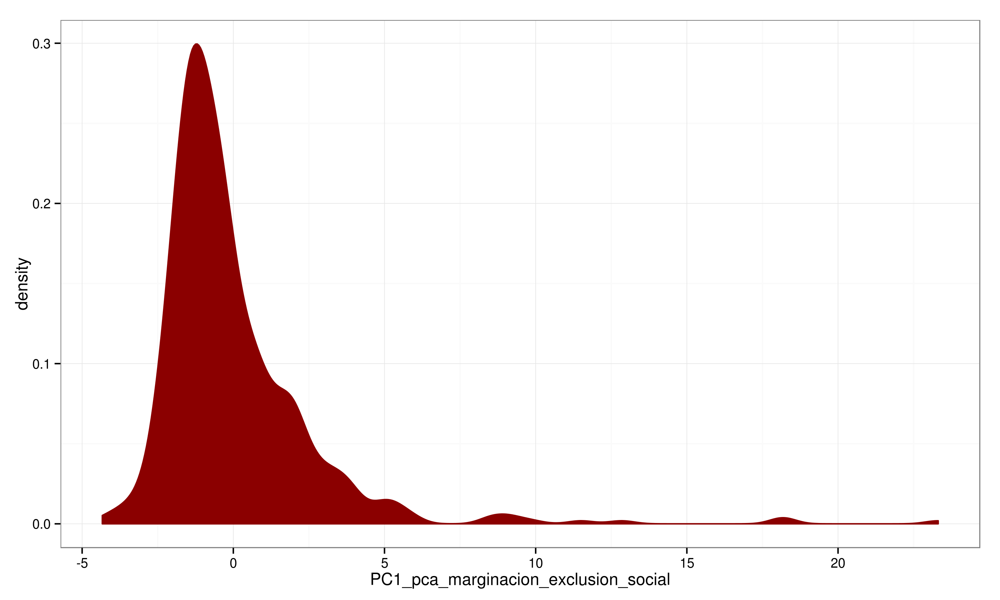

## Factores de riesgo {.flexbox .vcenter}


## Factores de riesgo {.flexbox .vcenter}


## Factores de riesgo {.flexbox .vcenter}
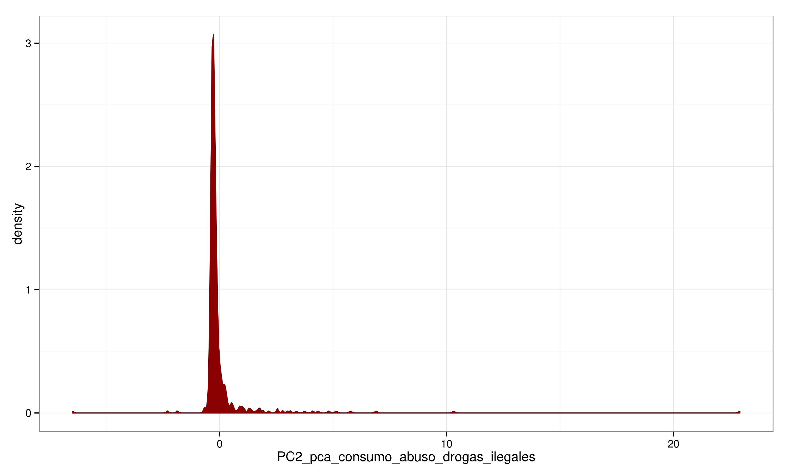

## Factores de riesgo {.flexbox .vcenter}


## Factores de riesgo {.flexbox .vcenter}


## Factores de riesgo {.flexbox .vcenter}


## Factores de riesgo {.flexbox .vcenter}
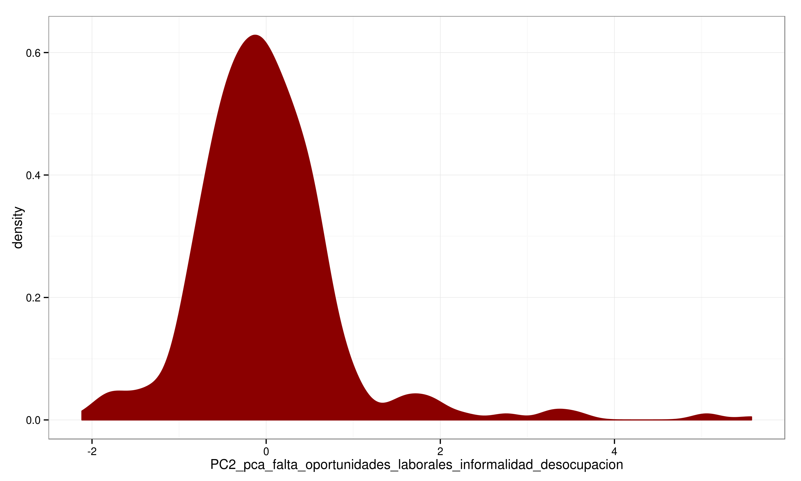

## Factores de riesgo {.flexbox .vcenter}


## Modelo {.flexbox .vcenter}

Siguiendo las recomendaciones del Dr. Vilalta se decidió utilizar de variables dependiente los delitos sumatoria de todos los delitos ajustada  por 100mil habitantes explicadas por los PCA 1 y 2 de los factores de riesgo 


### Modelo 1 
Delitos =  factores de riesgo 
glm familia gaussiana

### Modelo 2 
log 1+Delitos =  factores de riesgo 
glm familia gaussiana

##Modelos{.flexbox .vcenter}
### Modelo 3 
Delitos =  factores de riesgo 
glm familia poisson

### Modelo 4
 log 1+Delitos =  factores de riesgo 
glm familia poisson

### Modelo 5 
 Delitos =  factores de riesgo 
glm familia quasi-poisson

### Modelo 6 
 log 1+Delitos =  factores de riesgo 
glm familia quasi- poisson


## Modelo Gaussiano, tasa de delito por cien mil habitantes {.flexbox .vcenter}
```{r, echo=FALSE, message=FALSE, warning=FALSE, error=FALSE, results='asis'}
library(xtable)
load('mod')
print(xtable(summary(mm)), comment=F, include.rownames=F, size="tiny")
```


## Modelo Gaussiano, logaritmo de tasa de delito por cien mil habitantes {.flexbox .vcenter}
```{r, echo=FALSE, message=FALSE, warning=FALSE, error=FALSE, results='asis'}
load('mod_log')
print(xtable(summary(mm)), comment=F, include.rownames=F, size="tiny")
```


## Modelo Poisson, tasa de delito por cien mil habitantes {.flexbox .vcenter}
```{r, echo=FALSE, message=FALSE, warning=FALSE, error=FALSE, results='asis'}
load('mod_poiss')
print(xtable(summary(mm)), comment=F, include.rownames=F, size="tiny")
```


## Modelo Poisson, logaritmo de tasa de delito por cien mil habitantes {.flexbox .vcenter}
```{r, echo=FALSE, message=FALSE, warning=FALSE, error=FALSE, results='asis'}
load('mod_poiss_log')
print(xtable(summary(mm)), comment=F, include.rownames=F, size="tiny")
```


## Modelo Quasipoisson, tasa de delito por cien mil habitantes {.flexbox .vcenter}
```{r, echo=FALSE, message=FALSE, warning=FALSE, error=FALSE, results='asis'}
load('mod_q_poiss')
print(xtable(summary(mm)), comment=F, include.rownames=F, size="tiny")
```


## Modelo Quasipoisson, logaritmo de tasa de delito por cien mil habitantes {.flexbox .vcenter}
```{r, echo=FALSE, message=FALSE, warning=FALSE, error=FALSE, results='asis'}
load('mod_q_poiss_log')
print(xtable(summary(mm)), comment=F, include.rownames=F, size="tiny")
```

## Comparación de Modelos {.flexbox .vcenter}
$$ \begin{tabular}{rlrrr}
  \hline
 & .id & AIC & Dev & BIC \\ 
  \hline
1 & mod & 7695.79 & 193136137.25 & 7771.18 \\ 
  2 & mod\_log & 1932.16 & 1399.60 & 2007.55 \\ 
  3 & mod\_poiss & Inf & 196419.01 & Inf \\ 
  4 & mod\_q\_poiss &  & 196419.01 &  \\ 
  5 & mod\_poiss\_log & Inf & 405.68 & Inf \\ 
  6 & mod\_q\_poiss\_log &  & 405.68 &  \\ 
   \hline
\end{tabular} $$


## Selección de Variables {.flexbox .vcenter}
se quitaron as siguientes variables 
        PC1_pca_desercion_escolar -
         PC2_pca_espacios_publicos_insuficiente_deteriorado -
         PC2_pca_consumo_abuso_drogas_ilegales -
         PC1_pca_espacios_publicos_insuficiente_deteriorado -
         PC1_pca_embarazo_temprano -
         PC1_pca_consumo_abuso_drogas_ilegales -
         PC2_pca_embarazo_temprano,


## Conclusiones {.flexbox .vcenter}
El modelo poisson con la variable sin transformar obtiene peor devianza que el modelo gaussiano con la
variable y transformada. Sin embargo, los supuestos del modelo se sostienen mejor en el modelo Poisson.
Tanto el modelo poisson como el quasipoisson son iguales en devianza y los supuestos se cumplen de
manera aceptable.


## Recomendaciones {.flexbox .vcenter}

-El análisis muestra que existen diferentes clasificaciones por municipio donde se presentan los factores de riesgo y además se agrupan espacialmente. Por lo tanto la intervención para atacar estos factores debe ser diferenciada por municipio y por tipo de factor de riesgo. Por ejemplo, aquellos municipios donde el deterioro de los espacios públicos aparece como un factor de riesgo, deberán priorizar intervenciones para la mejora de espacios públicos.


## Gasto {.flexbox .vcenter}


